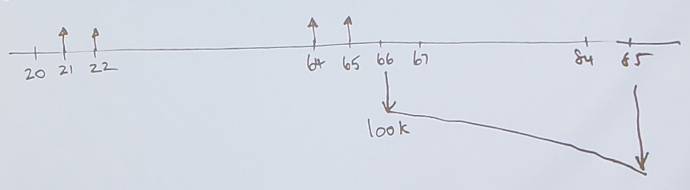

The Mathematics of Finance
==========================

Introduction
------------

Suppose:

::

    PV = 100
    FV = 110

What's more valuable?

Answer: depends on interest = r


Present Value vs Future Value
-----------------------------

.. math::

    FV  &= PV + rPV \\
        &= PV(1+r)

.. math:: 

    FV_{t=2} = PV*(1+r)^2 \\

.. admonition:: Future Value of Investement

    .. math::

        FV_{t=n} = PV*(1+r)^n
        
        
    - n = the number of compounding periods *in between PV and FV*
    - PV = the present value of investment (capital)  
    - :math:`FV_{t=n}` is the future value of an investment at the nth period  

.. hint:: 

    - r and n should talk in terms of the same time frame

        - e.g. if r is a per annum percentage, then n should be # years
        - e.g. if r is a monthly rate, then n should be # months


Brandon's Point of View Value Conversion Formula
````````````````````````````````````````````````

.. important::

    .. math::

        V_{t=f} = V_{t=i}*(1+r)^{c*(f-i)}
        
    - :math:`V_{t=t_o} =` Value of Investment at time :math:`t_o`
    - :math:`r =` interest rate compounded at the same unit of time as :math:`t_o`
    - f = final year
    - i = initial year
    - c = number of times interest is compounded per year
    

    .. note::

        Compared to other formula:

        - :math:`n = c*(f-i)`
        - :math:`PV = V_{t=i}`
        - :math:`FV = V_{t=f}`
        - new formula encapsulates the idea of moving the point of view of different valuations


.. admonition:: Alternate POV Conversion Formula

    .. math::

        V_{t \geq -n} \text{ is given}, n > 0 \rightarrow V_{t \geq 0} = V_{t \geq -n} * (1 + r)^n \\
        \\
        and \\
        \\
        V_{t \geq n} \text{ is given}, n > 0 \rightarrow V_{t \geq 0} = V_{t \geq n} * \frac 1 {(1 + r)^n}


    - multiply V by :math:`r^n, r = \text{interest rate}, n = \text{number of times r is compounded}` if moving V forward, divide by it if moving V back


Nominal Interest Rates
----------------------

- **nominal interest rate**, an interest rate "as stated" without adjustment for the full effect of compounding

    - is the effective interest rate compounded yearly
    - an interest rate is called nominal if the frequency of compounding (e.g. a month) is not identical to the basic time unit in which the nominal rate is quoted (normally a year)
    - e.g. "8% per year, compounded monthly" = nominal 8% per year compounded 12 times per year = :math:`j_{12} = 0.08`


.. admonition:: Naming of Nominal Interest Rates

    .. math:: 
        
        \text{nominal annual rate} = \text{nominal yearly rate} = j_1 \\
        \text{nominal quarterly rate} = j_4 \\
        \text{nominal monthly rate} = j_{12}


Effective Interest Rates
------------------------


- **Effective Interest Rate (EIR)**, the interest rate on a loan or financial product restated from the nominal interest rate as an interest rate with annual compound interest payable in arrears.

    - It is used to compare the annual interest between loans with different compounding periods like week, month, year, etc.

- **Effective Annual Rate (EAR)**, the interest rate as if it were compounded yearly instead of its actual compounding period


Conversion Between Nominal And Effective Interest Rates
```````````````````````````````````````````````````````

.. important::

    .. math::

        \frac {j_n} {n} = EIR_n

    - :math:`j_n =` nominal interest rate (that's expressed as an interest rate compounded yearly) for an effective interest rate componded n times monthly 
    - :math:`EIR_n` effective interest rate compounded n times monthly

.. note:: 

    The nominal interest rate is the same as the effective annual interest rate.

    .. math::

        j_1 = EIR_1

.. admonition:: Naming of Effective Interest Rates

    .. math:: 
        
        EAR = \text{effective annual rate} = \text{effective yearly rate} = EIR_{1} \\
        EQR = \text{effective quarterly rate} = EIR_{4} \\
        EMR = \text{effective monthly rate} = EIR_{12}

    - **Annual Percentage Rate (APR)**, an interest rate that is expressed as an EAR for an interest rate compounded twice per year (in Canada), often used for expressing the interest rate on items like car financing, etc.

        - :math:`APR = EIR_2`

Example: Basic Effective Annual Rate
''''''''''''''''''''''''''''''''''''

:: 

    invest                      $100
    each half year get          10%

then

    after 1/2yr you will get    $10
    at t = 1 (year)             $121

    EIR_2 = effective half year rate = 10%
    EIR_1 = EAR = 21%


Conversion Between Effective Interest Rates
```````````````````````````````````````````

.. important::


    .. math:: 
        
        \text{EIR}_X &= (1 + \text{EIR}_Y)^p - 1 \\
        \text{EIR}_X &= (1 + \text{EIR}_Y)^{Y/X} - 1

    - p = number of Y periods in an X period

Example: Basic Conversion
'''''''''''''''''''''''''

.. math:: 
    
    \text{EIR}_{yearly} &= (1 + \text{EIR}_{monthly})^{12} - 1 \\
    \text{EIR}_{1}      &= (1 + \text{EIR}_{12})^{12} - 1 

.. math:: 

    \text{EIR}_{monthly}    &= (1 + \text{EIR}_{yearly})^{1/12} - 1 \\
    \text{EIR}_{12}         &= (1 + \text{EIR}_{1})^{1/12} - 1 


Example: Converting Between Rates
''''''''''''''''''''''''''''''''''

:: 

    if
    20% p.a. (per annum) compounded twice a year
    APR - compounded twice per year in Canada
    j_2 = 20%

        J implies per year
        2 implies compounded twice per year

.. math:: 

    j_2 = 20\% \\

.. math:: 

    EIR_2   &= j_2/2 \\
    EIR_2   &= 0.2/2 \\
            &= 0.1 

.. math:: 

    EIR_1   &= (1 + 0.1)^2 - 1 \\
            &= 0.21 

.. math:: 

    EIR_{12} = (1 + 0.1)^{\frac 1 6} - 1

.. math:: 

    r_d = 10\% - APR ??

Example: Converting To Effective Annual Rate 
''''''''''''''''''''''''''''''''''''''''''''

.. math::

    EAR = (1 + EIR_n)^n - 1 \\
    \\
    EAR = (1 + 0.05)^2 - 1 = 0.1025 \\
    EAR = (1 + 0.025)^4 - 1 = 0.1038 \\

==  ================= =====================
n   :math:`EIR_n`     :math:`EAR = EIR_{1}`
==  ================= =====================
1   0.10              0.10
2   0.05              0.1025
4   0.025             0.1038 
12  0.0083            0.1043
==  ================= =====================


Continuously Compounded Rate
````````````````````````````

.. important:: 

    .. math:: 

        EAR = e^q - 1, \\
    
    - :math:`e = \text{Euler's Constant}`
    - :math:`q = \text{Continuously Compounded Rate}`

Example:
''''''''

.. math::

    EAR = e^{0.1} - 1 \\
        = 0.10517


Inflation
---------

::

    Invest          100
    nominal r       12%
    Exp r_inf       8%

=========           ====    ======
t =                 0       1       
=========           ====    ======
$/muffin            1       1.08
Cash                100     112     
# muffins           100     103.7   
=========           ====    ======

- :math:`\therefore` real rate of return = r* = 3.7%

- muffins is an analogy for t=0 dollars = real dollars we have at t=1

.. math::

    r*  &= \frac {1+r} {1 + r_{inf}} - 1 \\
    \\
        &= \frac {1 + 0.12} {1 + 0.8} - 1 \\
    \\
        &= 0.037

Perpetuity
----------

- *perpetuity*, a constant, regular stream of cash flows continuing forever and starting in exactly one period

    - constant -> same amount of cash flows every period
    - regular -> periods are regular

.. admonition:: Calculating the PV of perpetuity cash flows

    Suppose C = cash flow every period after period t=1

    .. math:: 

        PV = \frac {C} {1 + r} + \frac {C} {(1 + r)^2} + \frac {C} {(1 + r)^3} + ...    (1) \\
        PV(1+r) = PV + rPV = C + \frac {C} {1 + r} + \frac {C} {(1 + r)^2} + ...        (2) \\
        \\ 
        rPV = C                                                                         (1 - 2) \\
        \\
        PV = \frac {C} {r}

.. important::

    .. math::

        V_{t \geq 0} = P_{t \geq 1} = \frac {C_{t \geq 1}} r

    - C - cash flow at every period starting at period t=1
    - r - effective interest rate compounded every period
    - :math:`P_{t \geq 1} = \text{perpetuity starting with first cash flow at period t=1}`
    - :math:`V_{t \geq 0} = PV`

.. note::

    .. math::

        P_{t \geq a} = P_{t \geq b}, \text{for any }a, b


Example: Basic Perpetuity
`````````````````````````

::

    r = 10%, 
    C = $1000 p.a, starting at t=1

.. math::
    
    V_{t \geq 0}    &= {P_{t \geq 1}} \\
                    &= \frac {C_{t \geq 1}} {r} \\
                    &= \frac {1000} {0.01} \\
                    &= 10000 

Example 2: Displaced Perpetuity
```````````````````````````````

:: 

    r = 10%, 
    C = $1000 p.a, starting at t=0

Method 1: Component Addition
''''''''''''''''''''''''''''

.. math::

    V_{t \geq 0}    &= V_{t=0} + {P_{t \geq 1}} \\
                    &= 1000 + 10000 \\
                    &= 11000

Method 2: POV Conversion
''''''''''''''''''''''''

.. math::

    V_{t \geq -1}   &= {P_{t \geq 0}} \\
                    &= \frac {C_{t \geq 0}} {r} \\

.. math::

    V_{t \geq 0}    &= V_{t \geq -1} * (1 + r) \\
                    &= \frac {1000} {0.1} * (1 * 0.1) \\
                    &= 10000


Example: Fractionally Displaced Perpetuity
``````````````````````````````````````````

::

    r = 10%, 
    C = $1000 p.a, starting at t=0.5

.. math::

    V_{t \geq -0.5} &= {P_{t \geq 0.5}} \\
                    &= \frac {C_{t \geq 0.5}} {r} \\

.. math::

    V_{t \geq 0}    &= V_{t \geq -0.5} * (1 + r)^{0.5} \\
                    &= \frac {1000} {0.1} * (1 + 0.1)^{0.5} 


Annuity
-------

- **annuity**,  a constant, regular, finite cash flow stream starting in exactly one period

    - difference between Annuity and Perpetuity is that the cash flow ends at some point

.. important::

    .. math::

        V_{0 \leq t \leq n} &= A_{1 \leq t \leq n} \\
                            &= P_{t \geq 1} - P_{t \geq n} \\
                            &= (\frac {C} {r}) - (\frac {C} {r} * \frac {1} {(1+r)^n}) \\
                            &= \frac {C} {r} * (1 - \frac {1} {(1+r)^n}) \\

    - :math:`A_{1 \leq t \leq n} =` an annuity that starts on period t=1 and ends at period t=n
    - n = number of cash flow periods

.. note::

    .. math::

        A_{a \leq t \leq b} = A_{c \leq t \leq d}, \text{for any }b-a=d-c


Example: Basic Annuity
``````````````````````

::

    r = 10%
    Annual cash flows starting in 1 yr
    n = 20

.. math::

    V  &= \frac {C} {r} * (1 - \frac {1} {(1+r)^n}) \\
        &= \frac 1000 0.1 * (1 - \frac 1 {1.1^{20}}) \\
        &= 8513


Example: Displaced Annuity
``````````````````````````

:: 

    r = 10%
    Annual cash flows starting today
    Last cash flow in 20 years

.. math::

    V  &= \frac {C} {r} * (1 - \frac {1} {(1+r)^n})*(1+r) \\
        &= \frac {1000} {0.1} * (1 - \frac 1 {1.1^{21}}) * 1.1 \\
        &= 9513.56


Example: Displaced Annuity 2
````````````````````````````

::

    What is the value today of a policy that pays $1000 a year. 
    20 cash flows. 
    1st cash flow in 5 year. 
    r = 10%

.. math::

    V_{0 \geq t \geq 25}   &= V_{t \geq 5, n=20} \\
                            &= V_{5 \geq t  \geq 25} \\
                            &= \frac {\frac {C} {r} * (1 - \frac {1} {(1+r)^n})*(1+r)} {(1+r)^4} \\
                            &= \frac {1000} {0.1} * (1 - \frac 1 {1.1^{20}}) * 1.1

Steps
`````

1. Draw good timeline
2. Idenfity cash flow stream
3. Apply std formula
4. this gives V exactly one period before first cash flow
5. adjust as necessary


Geometric Growth
----------------

- e.g. "g by 10% per year"

Growth Perpetuity 
`````````````````

C = 1st cash flow

.. math::

    \text{if } g < r \\ 
    \text{then } P = \frac C {r-g} \\
    \\
    \text{if } g > r \\
    \text{then P doesn't converge} \\


Growth Annuity
``````````````

.. math:: 

    V = \frac C {r-g} * (1-(\frac {1+g} {1+r})^n)

    \text {as } n \rightarrow \infty , (\frac {1+g} {1+r})^n \rightarrow 0 , \text{ and } V = \frac C {r-g}


Example: Retirement Savings Plan
````````````````````````````````

::

    r = 10% 
    Today birthday t=20
    Deposit starting one year
    last deposit on birthday t=65
    first withdrawl birthday t=66
    last withdrawl on t=85
    withdrawl to grow at 3%
    first withdrawl to be 100k
    how much must you deposit each year?



.. math::

    \text{Amount needed at t=65}    &= V_{66 \leq t \leq 85} \\ 
                                    &= \frac {C_{First Withdrawl}} {r-g} * (1-(\frac {1+g} {1+r})^n) \\
                                    &= \frac {-100000} {0.1-0.03} * (1-(\frac {1.03} {1.1})^{20})

.. math::

    V_{21 \leq t \leq 65}  &= - V_{66 \leq t \leq 85} \\
                    &= - \frac {C_{deposit}} {0.1} * (1-(\frac {1} {1+0.1})^{45}) *(1+0.1)^{45} \\

.. math::

    C_{deposit} = \text{how much we must deposit each year}


Assignment Questions
--------------------

Question 8
``````````

.. image:: sometng

.. math::

    \text{eff q rate} = \frac {0.08} 4 = 0.02

.. math::

    \text{eff 1/2 rate} &= (1+0.02)^2 - 1 \\
                        &= 0.0404 

.. math::

    V_\text{bank acc today t=0}    &= \frac {4000} {0.0404} * (1 - \frac 1 {1.0404^{10}} * (1 + 0.0404)^{11} \\
                                    &= 50057

.. math::

    V_\text{bank acc today t=0} &= V_\text{withdrawls from today} \\
    V_\text{bank acc today t=0} &= V_\text{withdrawls from today PT1} + V_\text{withdrawls from today PT2} \\
    50057 &= [2C + \frac {2C} {0.035} * (1 - \frac 1 {1.035^5})] + [\frac C {0.035} * (1 - \frac 1 {1.035^6}) * \frac 1 {1.035^5}] 


Question 9
``````````

.. math:: 

    EAR = 10\%, EAR = e^q - 1 \\

.. math:: 

        0.1 &= e^q - 1 \\
        e^q &= 1.1 \\
        ln e ^ q &= ln 1.1 \\
        q &= ln 1.1 
        cont comp r = ln 1.1

.. math:: 

    eff m rate = (1+0.10)^{\frac 1 {12}} - 1

Question 3
``````````

.. math:: 

    Borrow $10000, r = 20\%
    Int = 2000/12000 \rightarrow $1000/month \text{in interest payments}

.. math::

    V = 10000 = \frac {1000} r * (1 - \frac 1 {(1+r)^{12}})

    \text{effective montlhy rate} = emr = (1 + EAR)^{1/12} - 1