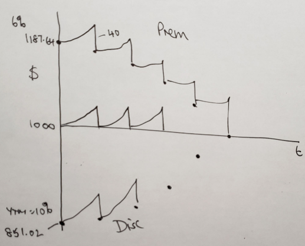

Fixed Income and Debt
=====================

- difference bewtween debt and equity as financial assets
    
    - payments on debt are *contractually* promised

        - debtholders can sue the issuer for default of principal or interest payments
        - tax deductible b/c interest is contractually proised and is an expense of the corporate issuer 

    - payments on equity are not
        
        - board of directors of a corporation can cut or eliminate dividends on a common share or a preferred share and the holders of these equity securities cannot (typically) sue the firm
        - not tax deductible because dividends are not contractually *guarenteed*, they are not an expense of the firm

- difference between private and public debt

    - private borrowing contracts = loans
    - public borrowing contracts = bonds

Example - Principal and Interest Payment Deconstruction
-------------------------------------------------------

.. math::

    Int_{213} = r * Debt_{212} \\
    Debt_{212} = \frac C r * (1 - \frac 1 {(1 + r)^n}, n = 88 \\
    Princ_{213} = C - Int_{213}

- :math:`Int_{213}` = interest portion debt payment at period = 213 
- :math:`Debt_{212}` = value of debt at period = 212
- :math:`Princ_{213}` = principal repayment portion of debt repayment at period 213

Public Debt Markets and Bond Valuation
--------------------------------------

- **bond**, a public financial asset that makes contractually promised payments for a finite term
- **bond's maturity**, the remaining term over which repayments are promised

- bond payments are often fixed and do not vary over the investment term
- interest on a floating bond varies in a predefined way with the general level of interest in the economy

- **coupons**, income payments on a bond

    - North America: bonds typically make semi-annual coupon payments
    - Europe: bonds typically make annual coupon payments

- **par value**, the value of the final payment made which is paid at maturity

    - par value :math:`\neq` not the value of the bond, but value of bond = f(par value)
    - par value :math:`\neq` not necessarily the amount originally borrowed, but amount original borrowed = f(par value)
    - establishes the coupon and maturity payments

- bonds are often sold as sets of bonds, called bond issues
- most public bond issues are between approx 10mill and 100million dollars

.. admonition:: Calculating Bond Coupons

    - coupons on a bond are calculated as a per annum coupon rate of interest times par divided by number of payments per year

    .. math::

        C_{\text{bond coupons}}     &= \frac {r_{c}} {n} * M \\

    - :math:`r_{c} = \text{annual coupon rate}`
    - :math:`M = \text{the par value of the bond}`
    - :math:`n = \text{number of payments per year}`

Yield to Maturity
`````````````````

- **yield to maturity**, internal rate of return on an investment in a bond on the promised payments to maturity, expressed as a :math:`j_2`, a rate compounded semi-annually

    - the internal rate of return is that hypothetical discount rate which makes net present value of a set of predicted future payments equal zero

    - linked to the <something> rate and risk premium
    - risk -> price -> YTM, where the arrow shows what influences what

- the promised payments are the remaining coupons and par value
- relative to required expenditure, the yield to maturity is the discount rate which makes the NPV of the investment equal zero

- yield on a bond changes contiuously over time as conditions in bond markets change

    - when bond market traders pay greater prices for a bond, yields fall because coupons and par are fixed
    - when rates of interest in the economy rise, the yields on bonds also tend to rise (and bond prices fall)

.. admonition:: Invoice Price of a Bond

    - **invoice price of a bond**, the dollar amount required to purchase a bond 

    .. math::

        \text{Invoice Price} = \frac C {y/2} * (1 - \frac 1 {(1 + y/2)^n}) + \frac M {(1 + y/2)^n}

    - C is the semi-annual coupon
    - y is the yield (per annum) compounded semi-annually
    - n is the number of six-month coupon periods to maturity
    - M is the par value of the bond

    - the bound matures in n/2 years
    - the invoice price of a bond is the presevent value of the annuity of the coupons plus the present valu eof the lump sum par value payment
    - because the bond value is established in trading between bond market participants, the coupons and par value repayment are fixed, while **the yield is a market determined rate**.


Example - Simple Bond
`````````````````````

::

    Face Value = Par Value = $1000
    Coupon Rate = 8%, twice / yr
    Coupon = 0.08/2 * 1000 = 40
    Time to Maturity = 14 years

.. image:: _static/simple_bond.png


- Coupon's are paid out during bond maturation
- Face Value paid out at time of maturity

- rate that is used to valuate the bond fluxuates depending on the expecation that the company will survive

    .. math::

        r = r_f + \text{risk premium}

- **yield to maturity (YTM)**, used to calculate the bond price which fluxates daily

YTM = 6%

.. math::

    Bond Pr &= \text{Annuity of Coupons} + \text{PV of Bond Payment} \\
            &= \frac {40} {0.03} * (1 - \frac 1 {(1 + 0.03)^{28}}) + \frac {1000} {(1.023)^{28}} \\
            &= 1187.64

- YTM = f(price of the bond, news about the bond issuing firm, time on bond)


Discounted Bonds
````````````````

-  why would a bond be valued at less than the par value?

    - the coupon rate is lower than prime rate?
    - characterized by high YTM: why?

.. admonition:: Discontinued Bonds

    .. math::

        \text{bond is discounted} \iff M < Pr \iff r_c < \text{current yield} < YTM


Random Bond Facts
`````````````````

.. admonition:: Bonds Priced at Par Value

    .. math::

        Pr = M \Rightarrow EIR_{y,2} = r_c

.. admonition:: YTM changes

    .. math::

        YTM \uparrow \Rightarrow Pr \downarrow


Bond Valuation Over Time
````````````````````````



- after the first coupon is paid, the value of the bond decreases
- between coupon payment periods, the value increases as you'd rather a bond that pays your first coupon sooner rather than later (e.g. in 1 month vs 6 months)

Example - Holding Period Rate of Return
```````````````````````````````````````

::

    Coupons             2/yr
    Buy 5 months before a coupon
    CR = Coupon Rate    = 7%/annum
    Face Value          = 10000
    29 coupons rate
    YTM = 8%

    keep for 4 years 9 months - sell
    YTM unchanged

    Back a/c r = j_2 = 8%

Holding period rate of return = HPRR, expressed as a j_2

    e.g. invest $100, after 5 years have $171
        then HPRR = 71%

Invest = Purchase Price
    At end -> Selling Price + Bank a/c

--

.. image:: _static/bond_question.png

.. math::

    Purchase Price  &= Annuity of Coupons + PV of Bond Payment \\
                    &= [\frac {350} {0.04} * (1 - \frac 1 {1.04^{29}}) + \frac {10000} {1.04^{29}}] * 1.04^{\frac 1 6} \\
                    &= 9210.83

.. math::

    Selling Price   &= [\frac {350} {0.04} * (1 - \frac 1 {1.04^{20}}) + \frac {10000} {1.04^{20}}] * 1.04^{\frac 4 6} \\
                    &= 9567.40

.. math::

    Bank Account    &= \frac {350} {0.04} * (1 - \frac 1 {1.04^9}) * 1.04^{9 + \frac 4 6} \\
                    &= 3802.10

.. math::

    HPRR    &= \frac {9547.4 + 3802.10 - 9210.83} {9210.83} \\
            &= 0.4515

4 yrs 9 months = 57 months
EIR_2 = (1 + 0.4515)^(6/57) - 1 = 0.04
j_2 = 0.04 * 2 = 8%


Example
```````

::
    
    Apartment
    6 months $120
    Selling Price = Invoice Price = Accrued Int + Quoted Price

YTM = r_f + risk premium
Bought for $500k

What does the rate of return depend on?
    Income Returns:
    Revenues
    Taxes you have to pay
    Insurance
    
    And:
    Capital Gain (even if apartment not sold)

.. math::

    YTM &= \text{Income Component} + \text{Capital Gain} \\
        &= \frac {\text{Annual Coupons in a year}} {Price} + \text{Capital Gain} \\
        &= \text{Current Yield (CY)} + \text{Capital Gain}

Random Table

\           Income      Capital Gain
========    ========    ============
Discount    small +     small +
Premium     big +       small -
        
- overall, Discount and Preimum are expected to be equal (in expected value?)

Risk
----

- There a number of risks associated with fixed income financial assets.

Price Risk + Interest Rate Risk
------------------------------

- Lower coupon rate bonds one have greater prime risk than lower coupon rate bonds, all else equal.
- Longer term bonds have greater price risk than shorter term bonds, all else equal.


Default Risk
------------


Reinvestment Risk
-----------------

- uncertainty about reinvesting the coupons
- uncertainty about what rates you will get for a coupon at a later stage
- reinvestment gives uncertainty about what rate you will get
- if YTMs drop in the future, you suffer because you can only invest at a lower rate, value of existing bond increases

Inflation Risk
--------------