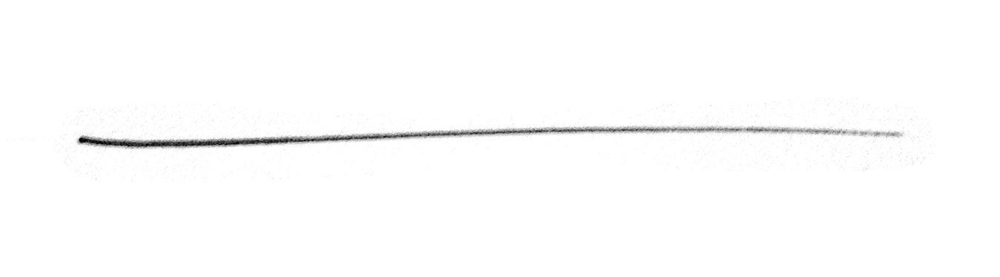
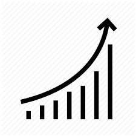

Equity Securities and Equity Markets
====================================

- shares give you a say in the management of a company
- value of a share is the present value of the future cash flows

    - question: what are those cash flows going to look like?

- valuation is far less certain than bonds
- non-voting shares are so the share issuer can maintain control of a company
- dividends are discretionary, they may or may not be paid out
    
    - companies don't like sending negative signals to the market, and not paying dividends is a negative signal
    - paying a dividend despite a bad year signals that the company is assured in that the bad performance is temporary
    - being conservative about paying dividends allows companys to pay dividends despite bad years

Preference Share
----------------

- also called a preferred share
- has a fixed dividend
- preferred shareholders are paid out dividends before common share holder
- preferred shareholders get paid off first if the company folds and the assets are liquidated
    
    - order of pay

        - liquidators, lawyers
        - gov't
        - employees
        - debt holders
        - preferred shareholders
        - common shareholders

- often do not have voting power

.. math::

    PV  &= P \\
        &= \frac {Div} r

Market Capitalization Rate
--------------------------

Cash Cow
````````



.. math::

    Pr = \frac {Div} r

Constant Growth
```````````````



.. math::

    Pr = \frac {Div} {r - g}


Example
'''''''

:: 

    Div = 2
    r = 0.1
    g = 0.05

.. math::

    Pr_{t=0}    &= \frac {2} {0.1 - 0.05} \\
                &= 40

.. math::

    Pr_{t=1.00001}  &= \frac {2 * 1.05} {0.1 - 0.05} \\
                    &= 42

.. math:: 

    Pr_{t=0.99999}  &= \frac {2} {0.1 - 0.05} * (1 + 0.1) \\
                    &= 44


Example
-------

b = retention ratio

    This number means that
    for every dollar of earnings available for distribution to shareholders, the firm distributes 100*(1-b) cents
    as a dividend to shareholders and retains 100*b cents for business reinvestment and growth.

E = earnings

- ROE here is different than the historic ROE we looked at before
- this ROE is on new money invested

.. math::

    \text{% growth in earnings} &= \frac {b*E*ROE} {E} \\
                                &= b*ROE \\
                                &= g

.. math::

    Pr  &= \frac {Div} {r - g} \\ 
        &= \frac {(1 - b)*E} {r - b*ROE}

- as b increases, the numerator decreases
- as b increases, the denominator decreases
- which effect dominates? it depends

====    =====   =====   =====
\       base    #1      #2
====    =====   =====   =====
EPS     3.50    3.50    3.50
r       0.1     0.1     0.1
b       0       0.2     0.5
ROE     --      0.2     0.05
Pr      35      46.67   28.33
g       0       0.04    2.5
====    =====   =====   =====

- EPS = earnings per share (probs in form of dividend)

- is the company doing well with the money it's retaining?
    
    - base standard investment rate is 0.1
    - case 1, ROE = 0.2 > 0.1 = r -> company is doing well with my money its retaining
    - case 2, ROE > 0.5 < 0.1 = r -> company is not doing well with the money its retaining


(N)PVGO = (net) present value of growth opportunities

    - what happens when b is 0?

Efficient Market Hypothesises
-----------------------------

- if you have a free operating market with low transaction costs and information is freely available then prices are correct

- **Weak Market Efficiency**, prices encorporate all past prices

    - inefficient in this way if people can look at historical prices to make an abnormal return

- **Semi-strong Market Efficiency**, all public information is incorporated in share prices
    
    - e.g. finding gold -> price change immediately before buyers can act, since sellers know the information too
    - inefficient in this way if people can use public knowledge to make an abnormal return
    - most people think that the market is efficient in at least the semi-strong form

- **Strong Market Efficiency**, all public and private information is incorporated in share prices

    - inefficient in this way if people can use insider knowledge to make an abnormal return

- if market is inefficient, then there are incorrect prices, and people can make an abnormal return

    - can people identify stocks for which the price is over/undervalued? if so, market is inefficient in some way


Example

*MV = market value of firm

=============   =========   ==============  ======================
\               general     cash offering   rights offering
=============   =========   ==============  ======================
\               ideal       underpricing    \
\               \           \               \
\               \           \               \
MV              50000
shares          1000
Sh price        50
\               \           \               \
NPV             30000
MV              80000
SH price        80
Invest needed   20000
Issue price     80          75              50
#new shares     250*        266.7           400**
\               \           \               \
MV              100000      100000          100000
# shares        1250        1266.7          1400
SH price        80          78.95           71.43
=============   =========   ==============  ======================


- *: 250 = 20000/80
- ** 1000/400 = 2.5 rights needed to buy a new share

- rights offerings must be priced at below value of shares for general case

- share price increases because shareholders expect dividends to increase as a result of investment

    - shareprice is a function of the expectation on dividend behavior

.. math::

    \text{Lost Value over 2.5 Shares}   &= \text{Value of 2.5 Old Shares} - \text{Value of 2.5 New Shares ??} \\
                                        &= 2.5 * 80 - 2.5 * 71.43 \\
                                        &= 200 - 178.56 \\ 
                                        &= 21.43 \\ 
                                        ???

A Right is granted per 2.5 shares in this ex.

.. math:: 

    \text{Value of Right}   &= 21.43/2.5 \\
                            &= 8.57 \\
                            ??


====================    ==========      =========   ========
\                       Exercise        Sell        Trash
====================    ==========      =========   ========
# shares                100             100         100
Start Eq                8000            8000        8000
Start Bank a/c          5000            5000        5000
Start Wealth            13000           13000       13000
\                       \               \           \
# shares bought         40              --          --
cash from rights        -2000           857         --
\                       \               \           \
# shared owned          140             100         100
End Eq                  10000*          7143        7143
End bank a/c            3000            5857        5000
End Wealth              13000           13000       12143**
====================    ==========      =========   ========

- *71.43 * 140 = 10000
- **note: 13000-12143 = 857


Assignment 9 - Question 4
`````````````````````````

==============  ============
Elect           20  
Chem            X
\               \
MV              20+X
\               \
Sh Pr           (20+X)/n
\               \
Inv needed      24
Rights/Share    1:1
\               \
\               \
#Sh             2n
New MV          20 + x + 24
New Shp         (44 + x)/2n
==============  ============

suppose:

    .. math::     

        (44+x)/2n = 0.75*(20x)/n
        x = 28


Value of a right = 0.80

    - value of the right is a function of the share price, so you can figure out the old share price from the value of the right

Old Share Price = 0.80/0.25 = 3.20
New Share Price = 2.40

3.2 = (20 + 2.8) / n => n = 4.8/3.2 = 15

